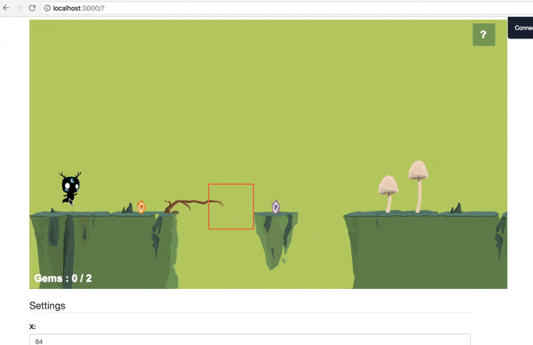
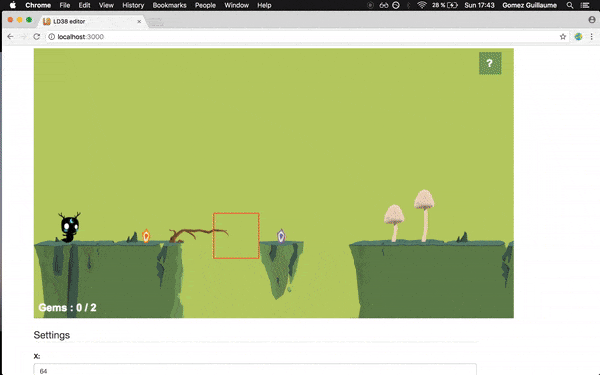
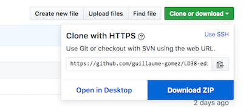

## LD38-editor
Preview :




## Install

### Requirements
- install node : [node](https://nodejs.org/en/)
- tiled : [tiled](http://www.mapeditor.org/)


### With a github account
`git clone https://github.com/guillaume-gomez/LD38-editor.git`

### Without a github account 
Dowload the repository


### In the folder
Open up your terminal and type:
```
npm install
npm start
```

go to localhost:3000 on your browser


